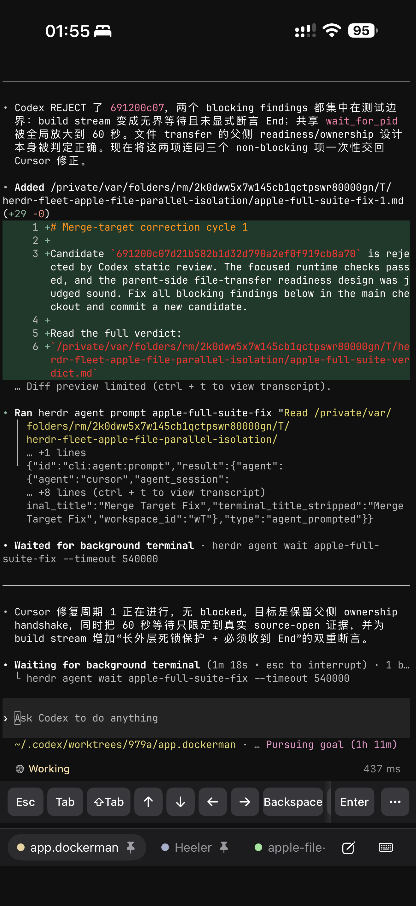

<div align="center">


# Heeler

**[herdr](https://herdr.dev) 的原生 iOS 伴侣应用 —— herdr 是一个 agent 优先的终端运行时。**

[](https://github.com/ZingerLittleBee/Heeler/actions/workflows/ci.yml)
[](LICENSE)
[](https://github.com/ZingerLittleBee/Heeler/stargazers)
[](https://www.swift.org)
[](https://developer.apple.com/ios/)
[](https://testflight.apple.com/join/aXSxRn4r)

**[通过 TestFlight 加入 beta](https://testflight.apple.com/join/aXSxRn4r)**

[English](./README.md) | 简体中文

</div>

---

Heeler 是一个 **agent 控制台**：把所有机器上正在运行的 coding agent 汇成一个原生仪表盘，按「谁需要你」排序。打开一个 Agent 即可阅读并操控它的实时终端，在原生 Composer 里用完整的 iOS 键盘起草，一次 Send 投递完整消息 —— 全程只走普通 SSH。

## 截图

| Agent Console | 实时终端 | Composer + 工具键盘 |
| --- | --- | --- |
|  |  |  |

| Terminal | Skills | 实时活动 |
| --- | --- | --- |
|  |  |  |

## 功能

- **Console** —— 所有机器上的 Agent 汇成一个按状态排序的列表（Blocked
  排最前），可按 Host 过滤，实时更新。
- **Attach** —— libghostty 渲染的 Agent 真实终端：原生历史回看、也能驱动全屏
  TUI 的惯性触摸滚动、长按选择、接管失效的终端占用者，并静默收集网页链接
  供稍后打开。
- **Composer** —— 在本地用完整的 iOS 键盘起草（自动纠错、输入法、听写），
  一次 Send 投递；工具键盘另有 Agent 控制键、Agent Skills、可复用的
  Snippets 和终端外观。
- **Terminal** —— 在 Agent 的目录打开普通 shell，带 Text / Keys 两种模式，
  每个工作区复用同一个 tab。
- **附件** —— 把照片或最大 64 MiB 的文件经 SFTP 暂存到 Host，并把路径
  插入草稿。
- **扫码配对** —— 扫描 Pairing Code 即可添加机器；密钥在设备上生成，私钥
  不离开 Keychain，配对码同时固定 host key 指纹。
- **通知 + 实时活动** —— Agent 进入 Blocked 或 Done 时的端到端加密推送，
  以及锁屏 / 灵动岛上实时跟踪 Agent 的横幅；中继永远读不到内容
  （[PRIVACY.md](PRIVACY.md)）。
- **Worktrees** —— 让 Agent 从工作区仓库的干净检出上启动。
- **外观** —— 跟随系统 / 浅色 / 深色；30 个终端主题，浅色深色各有独立
  槽位；内置 JetBrains Mono 与 IBM Plex Mono；双指缩放字号。
- **跳板机** —— 经 SSH 跳板访问不可直连的机器，两跳各自校验密钥。

## 连接原理

Heeler 通过 SSH 使用 herdr 的 JSON API：每个请求经 direct-streamlocal
通道直连 `herdr.sock`，一条长连接承载事件流，交互终端则在 SSH PTY 上运行
`herdr agent attach --takeover`。前提只有 SSH 访问和一个运行中的
herdr —— 不改服务器、不装额外软件包。SSH 服务器需允许 stream-local 转发
（OpenSSH 默认开启）；若被关闭，引导流程会明确指出。

不可直连的机器可以放在 SSH 跳板机之后：

- [逐步搭建远程访问](docs/guides/vps-jump-host-setup.md)
- [架构、安全边界与 VPS 迁移手册](docs/guides/vps-jump-host.md)

## 添加机器

在运行 herdr 的机器上（Node >= 20、herdr >= 0.7.5、已启用 OpenSSH 服务器
—— macOS 上是 **系统设置 > 通用 > 共享 > 远程登录**）：

```bash
herdr plugin install ZingerLittleBee/Heeler/plugin --ref main --yes
herdr plugin action invoke heeler.pair
```

用应用扫描弹出的 Pairing Code 二维码，机器即被添加为 Host —— 地址、
host key 指纹和 SSH 密钥注册全部由配对码承载。在应用里为该 Host 启用通知
后，同一个[插件](plugin/README.md)负责投递加密通知。

## 技术栈

- SwiftUI，iOS 18+，当前仅 iPhone（iPad 在计划中）
- 仓库内 `Packages/HeelerSSH`（libssh2 + OpenSSL）负责 SSH
- [libghostty-spm](https://github.com/lakr233/libghostty-spm) 负责终端仿真与 Metal 渲染

选型缘由见 `docs/adr/`（传输层的故事尤其不直观）。

## 参与贡献

欢迎 Issue 和 PR：仓库结构、构建与测试、提交约定见 [CONTRIBUTING.md](CONTRIBUTING.md)。

## 状态

Beta，已上 [TestFlight](https://testflight.apple.com/join/aXSxRn4r)。以个人日常使用打磨为先，仍有粗糙之处，迭代较快。与 herdr 项目无隶属关系。
